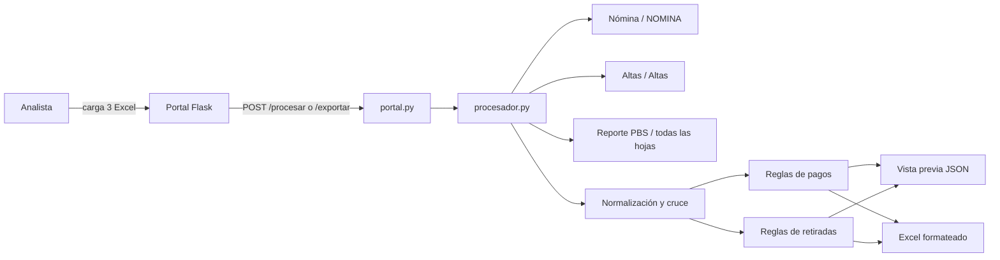

# Revisión automatizada de pagos de sobrevivencia

Aplicación local para cruzar la **Nómina**, las **Altas de sobrevivencia** y el **reporte de revisión PBS** de un período. Genera dos tipos de revisión:

- **Pagos pendientes y no pendientes:** identifica pendientes, suspendidos, diferencias de monto y registros con información insuficiente.
- **Retiradas:** valida la fecha de finalización de la renta según la relación del beneficiario y su edad.

La aplicación activa es un portal web local construido con Flask. Los archivos se reciben en memoria, se procesan con pandas y se devuelven como una vista previa JSON o como un Excel formateado.

## Contenido

- [Arquitectura](#arquitectura)
- [Requisitos e instalación](#requisitos-e-instalación)
- [Uso](#uso)
- [Archivos de entrada](#archivos-de-entrada)
- [Flujo completo](#flujo-completo)
- [Cruce de beneficiarios](#cruce-de-beneficiarios)
- [Reglas de negocio: pagos](#reglas-de-negocio-pagos)
- [Reglas de negocio: retiradas](#reglas-de-negocio-retiradas)
- [Salidas](#salidas)
- [API HTTP](#api-http)
- [Referencia de funciones](#referencia-de-funciones)
- [Estructura del repositorio](#estructura-del-repositorio)
- [Limitaciones y consideraciones](#limitaciones-y-consideraciones)

## Arquitectura



Responsabilidades principales:

| Capa | Archivos | Responsabilidad |
|---|---|---|
| Interfaz | `templates/index.html`, `static/app.js`, `static/styles.css` | Carga de archivos, selección del reporte, vista previa y descarga. |
| API | `portal.py` | Valida la solicitud, lee los archivos, selecciona el proceso y entrega JSON o Excel. |
| Dominio y procesamiento | `procesador.py` | Lee, normaliza, cruza, aplica las reglas de negocio y formatea la salida. |
| Prototipos históricos | `test.py`, `test_2.py`, `DataFrame_pagos.py`, `retiradas.py` | Iteraciones anteriores usadas para desarrollar o validar la lógica. No son pruebas automatizadas ni forman parte del portal activo. |
| Maqueta alternativa | `web_app/` | Prototipo visual en React/vinext. No está conectado al backend Flask ni procesa archivos. |

## Requisitos e instalación

- Python 3.10 o posterior recomendado.
- pip.
- Windows, macOS o Linux. El iniciador `.bat` solo funciona en Windows.
- Archivos `.xlsx` o `.xlsm` con la estructura esperada.

Instalación:

```bash
python -m venv .venv
```

En Windows:

```powershell
.venv\Scripts\Activate.ps1
python -m pip install -r requirements.txt
```

En macOS o Linux:

```bash
source .venv/bin/activate
python -m pip install -r requirements.txt
```

Dependencias directas:

- **Flask:** servidor web y endpoints HTTP.
- **pandas:** lectura, transformación y serialización de tablas.
- **openpyxl:** lectura, escritura y formato de libros Excel.
- **NumPy:** valores ausentes, conversiones y cálculos auxiliares; se instala normalmente como dependencia de pandas.

## Uso

### Portal web

Ejecuta:

```bash
python portal.py
```

En Windows también puedes abrir `iniciar_portal.bat`.

Después visita [http://127.0.0.1:5000](http://127.0.0.1:5000), carga los tres archivos del mismo período, selecciona el tipo de reporte y pulsa **Ver resultados**. La fecha de corte solo interviene en el cálculo de indexaciones del reporte de pagos.

La descarga vuelve a ejecutar el procesamiento con los archivos seleccionados y genera:

- `pendientes_no_pendientes.xlsx`, o
- `retiradas.xlsx`.

### Uso directo desde Python

Las funciones principales trabajan con bytes y devuelven una pareja `(archivo_excel, dataframe)`:

```python
from procesador import generar_pagos, generar_retiradas

with open("Nomina del periodo.xlsm", "rb") as f:
    nomina = f.read()
with open("Altas del periodo.xlsx", "rb") as f:
    altas = f.read()
with open("Reporte PBS del periodo.xlsm", "rb") as f:
    base = f.read()

excel_pagos, tabla_pagos = generar_pagos(
    nomina,
    altas,
    base,
    fecha_corte="2026-07-31",
)

with open("pendientes_no_pendientes.xlsx", "wb") as f:
    f.write(excel_pagos.getvalue())

excel_retiradas, tabla_retiradas = generar_retiradas(nomina, base)
```

## Archivos de entrada

Aunque la interfaz muestra `.xls` como formato aceptado, el motor utilizado es `openpyxl`; en la práctica deben usarse `.xlsx` o `.xlsm`. Los nombres de archivo son libres, pero las hojas, el orden y las columnas deben conservarse.

### 1. Nómina

- Debe contener una hoja llamada exactamente `NOMINA`.
- Debe tener al menos 28 columnas.
- El programa identifica los campos **por posición**, no por el texto del encabezado. Esto permite tolerar encabezados con caracteres dañados, pero hace obligatorio mantener el orden.

| Posición Excel | Índice pandas | Campo interno | Uso |
|---:|---:|---|---|
| A | 0 | `COMPANIA` | Compañía de seguros. |
| B | 1 | `SOLICITUD` | Número de solicitud. |
| C | 2 | `AFP` | AFP. |
| D | 3 | `CEDULA` | Cédula del afiliado y clasificación de pendiente. |
| E | 4 | `NOMBRE_AFILIADO` | Nombre del afiliado. |
| F | 5 | `FECHA_FALLECIMIENTO` | Respaldo cuando no hay datos PBS. |
| G | 6 | `DOCUMENTO_BEN` | Documento del beneficiario. |
| H | 7 | `NOMBRE_BEN` | Nombre del beneficiario. |
| J | 9 | `FECHA_NACIMIENTO_BEN` | Respaldo para edades. |
| K | 10 | `RELACION` | Relación del beneficiario. |
| M | 12 | `DISCAPACITADO` | Indicador de discapacidad. |
| N | 13 | `ESTATUS` | `R` identifica retiradas. |
| P | 15 | `FECHA_PAGO` | Fecha de pago. |
| T | 19 | `RENTA_NETA` | Renta neta mensual. |
| V | 21 | `FECHA_FIN` | Respaldo de finalización de renta. |
| Z | 25 | `MONTO_PRIMER_PAGO` | Monto pagado por la aseguradora. |
| AB | 27 | `TIPO_OPERACION` | Tipo de operación. |

### 2. Altas de sobrevivencia

- Debe contener una hoja llamada exactamente `Altas`.
- El reporte de pagos necesita al menos 13 columnas porque usa hasta la posición M.
- Los campos también se identifican por posición.

| Posición Excel | Índice pandas | Campo interno | Uso |
|---:|---:|---|---|
| A | 0 | `SOLICITUD` | Número de solicitud. |
| D | 3 | `CEDULA` | Cédula del afiliado. |
| F | 5 | `FECHA_FALLECIMIENTO_ALTA` | Disponible en la entrada; actualmente no se exporta. |
| H | 7 | `NOMBRE_BEN` | Nombre del beneficiario. |
| I | 8 | `RELACION_ALTA` | Relación del beneficiario. |
| J | 9 | `FECHA_RESPUESTA_ALTA` | Inicio para indexaciones en pendientes o respaldos. |
| K | 10 | `PRIMER_PAGO_AFP` | Monto reportado por la AFP. |
| M | 12 | `PENSION_MENSUAL_ALTA` | Total de pensión usado para pendientes. |

### 3. Reporte de revisión PBS

- Se leen y concatenan **todas sus hojas**.
- Todas deben mantener el mismo esquema.
- Si hay varias versiones de un registro, la base se ordena por `FECHA_TRANSMISION` descendente para priorizar la más reciente.

Columnas utilizadas:

`CEDULA`, `NUMERO_SOLICITUD`, `ID_BENEFICIARIO`, `BEN_PRIMER_NOMBRE`, `BEN_SEGUNDO_NOMBRE`, `BEN_PRIMER_APELLIDO`, `BEN_SEGUNDO_APELLIDO`, `BEN_FECHA_NACIMIENTO`, `BEN_RELACION`, `DISCAPACITADO`, `BEN_ESTATUS`, `FECHA_RESP_SEGURO`, `FECHA_FALLECIMIENTO`, `FECHA_FIN_RENTA`, `TOTAL_PENSION` y `FECHA_TRANSMISION`.

### Validación de entradas

El portal comprueba que existan los tres campos de carga y limita el cuerpo de la solicitud a 80 MiB. La validación detallada ocurre al procesar: una hoja ausente, una posición faltante o una columna PBS inexistente genera una respuesta de error HTTP 500 con el mensaje correspondiente.

El archivo de Altas es obligatorio en la interfaz incluso para **Retiradas**, aunque ese flujo no utiliza su contenido después de leerlo.

## Flujo completo

1. El navegador habilita el botón cuando se seleccionan los tres archivos.
2. `POST /procesar` envía `multipart/form-data` con Nómina, Altas, PBS, tipo y fecha de corte.
3. `portal.py` lee cada carga como bytes y decide entre `generar_pagos` y `generar_retiradas`.
4. `preparar_nomina` lee `NOMINA`, asigna nombres internos por posición y crea claves normalizadas.
5. `preparar_base` concatena todas las hojas PBS, construye el nombre completo, crea claves normalizadas y ordena por transmisión reciente.
6. Para pagos, también se lee `Altas`, se determina si cada fila está pendiente y se cruza el beneficiario con Nómina/PBS.
7. Para retiradas, primero se filtra Nómina por `ESTATUS = R` y luego se cruza cada fila con PBS.
8. Se aplican las reglas descritas más adelante y se construye un `DataFrame` de salida.
9. `/procesar` serializa el resultado a JSON para la tabla y el resumen del navegador.
10. Al pulsar **Exportar a Excel**, el navegador llama a `POST /exportar`. El servidor repite el proceso, aplica formato con `openpyxl` y devuelve el archivo como adjunto.

La aplicación no implementa una base de datos ni una escritura permanente de las cargas. No obstante, el servidor web o el sistema operativo podrían usar buffers temporales al recibir archivos grandes; debe ejecutarse en un entorno controlado.

## Cruce de beneficiarios

### Normalización

- Todo texto pasa a mayúsculas.
- Se eliminan tildes, espacios, guiones, puntuación y cualquier carácter que no sea `A-Z` o `0-9`.
- Las solicitudes que comienzan por `SCOT` se convierten a prefijo `CREC` para unificar códigos históricos.
- Los documentos numéricos se completan a 11 caracteres con ceros a la izquierda.
- Se elimina el sufijo decimal `.0` que Excel puede introducir en documentos numéricos.
- Vacíos, `0`, `NAN` y `NONE` se consideran documentos ausentes.

### Alcance de búsqueda

`seleccionar_candidato` prueba, en este orden:

1. Misma cédula **y** misma solicitud.
2. Misma solicitud.
3. Misma cédula.

Dentro de cada alcance selecciona el primer resultado confiable según esta prioridad:

1. Documento de beneficiario exacto, cuando la fila origen dispone de uno.
2. Nombre normalizado exacto.
3. Compatibilidad por tokens: uno de los conjuntos de palabras debe estar contenido en el otro, ambos con al menos dos tokens. Se ignoran `DE`, `DEL`, `LA`, `LAS`, `LOS` y `Y`.
4. Similitud aproximada mediante `SequenceMatcher`:
   - puntaje mínimo de `0.90`, y
   - puntaje de al menos `0.95` **o** ventaja mínima de `0.10` respecto al segundo candidato.

Si ninguna alternativa es confiable, la función devuelve `None`. Como PBS está ordenada por transmisión descendente, una coincidencia exacta normalmente toma el registro más reciente.

> [!NOTE]
> Los reintentos por solo solicitud o solo cédula recuperan variaciones entre archivos, pero amplían el universo de candidatos. Las alertas y casos sin datos deben conservar una revisión humana, especialmente si existen homónimos.

## Reglas de negocio: pagos

### Clasificación pendiente

Una fila de Altas es **pendiente** cuando su cédula, tal como aparece en Altas después de convertirla a texto y quitar espacios externos, no existe de forma idéntica en la columna de cédula de Nómina.

Esta comparación es deliberadamente literal: no usa la cédula normalizada ni consulta un estatus manual de Altas.

### Suspensión

Solo para una fila clasificada como pendiente se busca al beneficiario en PBS. Si `BEN_ESTATUS`, sin espacios y en mayúsculas, es `S`, el caso se marca como suspendido. Los demás datos de esa fila continúan viniendo de Altas.

### Comparación de montos

```text
Diferencia = MONTO PRIMER PAGO ASEGURADORA - MONTO PRIMER PAGO AFP
```

La diferencia se redondea a dos decimales. Se considera equivalente cuando su valor absoluto es menor o igual a `0.01`.

La decisión sigue esta precedencia:

| Condición | Validación | Comentario | Status |
|---|---|---|---|
| Pendiente y `BEN_ESTATUS = S` en PBS | `S` | Suspendido en PBS | Suspendido |
| Cédula de Altas no está en Nómina | `P` | Pendiente de pago | Pendiente |
| Falta uno de los dos montos | `SIN DATOS` | Falta información para comparar los montos | No pendiente |
| `abs(diferencia) <= 0.01` | `OK` | Vacío | No pendiente |
| Cualquier otra diferencia | `E` | Error en pago | No pendiente |

Cuando un no pendiente no encuentra beneficiario en PBS ni en Nómina, se agrega el comentario `Beneficiario no encontrado en PBS ni en Nomina`.

### Origen de los datos de salida

- **Pendiente o suspendido:** nombre, relación, pensión mensual y fecha de respuesta salen de Altas. El identificador del beneficiario, edad al fallecimiento y fin de renta quedan vacíos.
- **No pendiente con coincidencia PBS:** PBS es la fuente principal para documento, primer nombre, relación, total de pensión, fechas y edades.
- **No pendiente sin coincidencia PBS pero con coincidencia en Nómina:** Nómina sirve como respaldo para documento, nombre, relación y fechas. `TOTAL PENSION` queda vacío y la fecha de Altas inicia las indexaciones.
- **Sin coincidencia:** se conservan los datos disponibles de Altas y se añade el comentario de revisión.

### Indexaciones

La cantidad de indexaciones representa bienios completos:

```text
años_completos = años transcurridos ajustados por mes y día
indexaciones = max(años_completos // 2, 0)
```

- Para coincidencias PBS, el inicio es `FECHA_RESP_SEGURO`.
- Para pendientes o respaldos de Nómina, el inicio es `FECHA_RESPUESTA_ALTA`.
- El final es la fecha de corte elegida en el portal.
- Una fecha ausente o una fecha de corte anterior al inicio produce `0`.

### Edad y fin de renta

- `H` (hijo/a): la salida muestra la edad cumplida en `FECHA_FIN_RENTA`.
- `C` (cónyuge): muestra la fecha de fin; si no existe, muestra `VITALICIA`.
- Otras relaciones: el valor queda vacío.

### Bandeja de excepciones

Antes de exportar, se eliminan todas las filas con validación `OK`. Por tanto, `pendientes_no_pendientes.xlsx` contiene únicamente casos que requieren atención: `S`, `P`, `SIN DATOS` o `E`.

## Reglas de negocio: retiradas

### Selección

Solo se procesan filas de Nómina cuyo `ESTATUS`, sin espacios y en mayúsculas, sea `R`. Cada una se cruza con PBS y las fechas oficiales para la revisión salen de PBS.

### Sin coincidencia PBS

Si no existe una coincidencia confiable:

- se conserva el nombre de Nómina;
- las fechas, relación y datos de validación quedan vacíos;
- el resultado es `ALERTA: Sin coincidencia en la base`.

### Hijos (`BEN_RELACION = H`)

Se calcula:

```text
edad decimal al fin = (FECHA_FIN_RENTA - BEN_FECHA_NACIMIENTO) / 365.2 días
```

El resultado es `OK` cuando se cumple una de estas condiciones:

- la edad cumplida en la fecha de fin es exactamente 21 años; o
- la fecha de fin coincide exactamente con el cumpleaños 18, excepción histórica conservada por la lógica.

Cualquier otro caso genera `ALERTA: Edad de retiro incorrecta`.

### Cónyuges (`BEN_RELACION = C`)

Se calcula la edad cumplida del cónyuge en la fecha de fallecimiento del afiliado:

| Edad al fallecimiento | Duración mínima | Validación |
|---:|---:|---|
| Hasta 50 años inclusive | 5 años desde el fallecimiento | `FECHA_FIN_RENTA >= fecha esperada` |
| De 51 a 55 años inclusive | 6 años desde el fallecimiento | `FECHA_FIN_RENTA >= fecha esperada` |
| Más de 55 años | Vitalicia | Toda retirada genera alerta |

Resultados:

- Si la fecha de fin alcanza o supera la esperada: `OK`.
- Si termina antes: `ALERTA: Retiro antes del plazo`.
- Si corresponde renta vitalicia: `ALERTA: Renta vitalicia retirada`.

### Otras relaciones

Una relación distinta de `H` o `C` produce `ALERTA: Relación no contemplada`.

A diferencia del reporte de pagos, el reporte de retiradas conserva tanto los registros `OK` como las alertas.

## Salidas

### Pagos

Hoja `Pagos` con estas columnas:

1. Número de Solicitud
2. Cédula del beneficiario
3. Primer nombre
4. Relación con el beneficiario
5. TOTAL PENSION
6. Cantidad de indexaciones
7. MONTO PRIMER PAGO AFP
8. MONTO PRIMER PAGO ASEGURADORA
9. Diferencia
10. Validación
11. Comentario
12. Edad al fallecimiento
13. Edad/fecha fin de renta
14. Status

### Retiradas

Hoja `Retiradas` con identificación del afiliado y beneficiario, fechas, renta, tipo de operación, edad calculada, valor esperado, resultado automático y campos vacíos para responsable, fecha de revisión y observación.

### Formato común

- Encabezados azules y en negrita.
- Primera fila congelada.
- Autofiltro habilitado.
- Anchos calculados a partir de las primeras 80 filas, entre 12 y 34 caracteres.
- Fechas con formato `dd/mm/yyyy` en las columnas configuradas.
- Montos con dos decimales.
- Validaciones `OK` en verde.
- Errores, falta de datos y alertas en rojo.
- Status `Pendiente` o `Suspendido` en amarillo.

## API HTTP

### `GET /`

Renderiza el portal y establece la fecha actual como fecha de corte predeterminada.

### `POST /procesar`

Recibe `multipart/form-data`:

| Campo | Tipo | Requerido | Descripción |
|---|---|---:|---|
| `nomina` | archivo | Sí | Libro con hoja `NOMINA`. |
| `altas` | archivo | Sí | Libro con hoja `Altas`. |
| `base` | archivo | Sí | Reporte PBS multih hoja. |
| `tipo` | texto | No | `pagos` por defecto o `retiradas`. |
| `fecha_corte` | fecha ISO | No | Hoy por defecto. Solo se usa en pagos. |

Respuesta exitosa:

```json
{
  "columnas": ["..."],
  "registros": [{"...": "..."}],
  "total": 12,
  "nombre_archivo": "pendientes_no_pendientes.xlsx"
}
```

### `POST /exportar`

Recibe los mismos campos, repite el procesamiento y devuelve el Excel con el MIME type de Office Open XML. La cabecera `X-Registros-Procesados` indica la cantidad de filas exportadas.

### Errores

En modo normal, toda excepción se devuelve como:

```json
{"error": "mensaje"}
```

con estado HTTP 500. En modo debug la excepción se vuelve a lanzar.

## Referencia de funciones

### `portal.py`

| Función | Descripción |
|---|---|
| `inicio()` | Renderiza `index.html` y entrega la fecha de hoy. |
| `generar_reporte_solicitado()` | Valida las cargas, lee bytes, selecciona pagos/retiradas y devuelve archivo, tabla y nombre. |
| `procesar()` | Convierte el `DataFrame` a registros JSON para la vista previa. |
| `exportar()` | Envía el Excel como descarga y agrega el total en una cabecera. |
| `manejar_error(error)` | Uniforma las excepciones como JSON cuando debug está desactivado. |

### `procesador.py`: utilidades de normalización y cruce

| Función | Descripción |
|---|---|
| `normalizar_texto(valor)` | Convierte un valor a clave alfanumérica, mayúscula y sin tildes. |
| `normalizar_solicitud(valor)` | Normaliza texto y unifica el prefijo `SCOT` como `CREC`. |
| `normalizar_documento(valor, completar=True)` | Limpia documentos, corrige `.0`, trata vacíos y completa 11 dígitos. |
| `nombre_base(df)` | Une los cuatro campos de nombre PBS en un nombre completo. |
| `similitud(a, b)` | Calcula similitud entre dos textos normalizados. |
| `tokens_nombre(valor)` | Extrae palabras significativas de un nombre y elimina conectores. |
| `nombres_compatibles(a, b)` | Acepta cambios de orden o apellidos adicionales mediante inclusión de tokens. |
| `leer_archivo(contenido, hoja=None, todas=False)` | Lee bytes Excel con `openpyxl`, una hoja o todas. |
| `preparar_base(contenido)` | Concatena PBS, crea nombres/claves y prioriza transmisiones recientes. |
| `preparar_nomina(contenido)` | Lee `NOMINA`, renombra posiciones y crea claves normalizadas. |
| `seleccionar_candidato(fila, tabla, nombre_fila, nombre_tabla)` | Ejecuta la estrategia jerárquica de cruce y devuelve la mejor fila o `None`. |

### `procesador.py`: fechas, negocio y salida

| Función | Descripción |
|---|---|
| `fecha(valor)` | Convierte valores a fecha; reconoce primero ISO y usa día/mes para el resto. |
| `edad_cumplida(nacimiento, evaluacion)` | Calcula años completos respetando si ya pasó el cumpleaños. |
| `cantidad_indexaciones(inicio, corte)` | Cuenta bienios completos, nunca menos de cero. |
| `edad_o_fin(registro)` | Devuelve edad final para hijos, fecha/`VITALICIA` para cónyuges o vacío. |
| `aplicar_estilo_tabla(...)` | Ajusta encabezados, formatos, filtros, anchos y colores del Excel en memoria. |
| `generar_pagos(...)` | Orquesta lectura, clasificación, cruces, montos, indexaciones, filtrado de `OK` y Excel de pagos. |
| `generar_retiradas(...)` | Filtra estatus `R`, cruza PBS, valida edades/plazos y crea el Excel de retiradas. |

### `static/app.js`

| Función | Descripción |
|---|---|
| `normalizeKey(value)` | Normaliza encabezados para localizar columnas de resumen sin depender de tildes. |
| `refreshFiles()` | Actualiza nombres/estados de carga y habilita el botón al completar tres archivos. |
| `clearResults()` | Oculta y vacía la vista previa al cambiar entradas. |
| `formatValue(value)` | Presenta vacíos, números y fechas con formato `es-DO`. |
| `renderSummary(columns, rows)` | Agrupa pagos por `Status` o retiradas por resultado automático. |
| `renderTable(payload)` | Construye encabezado, filas, contador y resumen con nodos DOM seguros. |

Los listeners del archivo envían el formulario a `/procesar`, administran estados de carga y descargan el blob devuelto por `/exportar`.

### `retiradas.py` (flujo independiente histórico)

Este script ejecuta una revisión desde rutas fijas y escribe `retiradas.xlsx` en disco. Tiene reglas y mensajes más detallados que el portal, pero **el portal no lo importa**.

| Función | Descripción |
|---|---|
| `texto_comparable(valor)` | Equivalente histórico de normalización textual. |
| `normalizar_cedula(valor)` | Limpia y completa cédulas. |
| `normalizar_documento(valor)` | Limpia documentos y reconoce más representaciones vacías. |
| `normalizar_solicitud(valor)` | Unifica `SCOT` y `CREC`. |
| `preparar_nombre(nombre)` | Produce versiones directa y ordenada del nombre. |
| `similitud_nombres(nombre_1, nombre_2)` | Toma la mayor similitud directa o por palabras ordenadas. |
| `edad_cumplida(...)` | Calcula edad entera. |
| `sumar_anos(fecha, anos)` | Suma años con `DateOffset`. |
| `nombre_beneficiario_base(df)` | Construye el nombre completo PBS. |
| `seleccionar_registro_base(fila_nomina, base)` | Cruza dentro de cédula+solicitud e informa el método usado. |
| `evaluar_retiro(...)` | Aplica reglas de hijos/cónyuges con alertas detalladas. |
| `ajustar_formato(archivo, cantidad_filas)` | Crea títulos, celdas combinadas, colores y formatos del archivo histórico. |
| `main()` | Lee rutas constantes, procesa retiradas, escribe el archivo y muestra conteos. |

### Scripts exploratorios

- `test.py`: primera separación de pendientes/no pendientes y comparación de pagos.
- `test_2.py`: prototipo automatizado que añadió equivalencia `SCOT`/`CREC`, cruce aproximado y bandeja de excepciones.
- `DataFrame_pagos.py`: experimento anterior de consolidación y diferencias.

Estos archivos ejecutan trabajo al importarse, usan nombres mensuales fijos y generan Excel en el directorio actual. No deben tratarse como una suite de pruebas. La lógica vigente es la de `procesador.py`.

### `web_app/`

- `Home()` en `app/page.tsx` renderiza una maqueta de la pantalla de carga.
- `RootLayout()` en `app/layout.tsx` define metadatos, idioma, fuentes y estructura HTML.

Los controles son visuales: no hay integración con `/procesar` o `/exportar`. El portal funcional usa `templates/` y `static/`.

## Estructura del repositorio

```text
pagos_auto/
├── portal.py                 # Servidor y API Flask
├── procesador.py             # Lógica vigente de negocio
├── requirements.txt          # Dependencias Python
├── iniciar_portal.bat        # Inicio rápido en Windows
├── templates/
│   └── index.html            # Página del portal
├── static/
│   ├── app.js                # Interacción y llamadas a la API
│   └── styles.css            # Estilos del portal
├── retiradas.py              # Implementación histórica independiente
├── test.py                   # Prototipo histórico (no prueba automática)
├── test_2.py                 # Prototipo histórico (no prueba automática)
├── DataFrame_pagos.py        # Exploración histórica
└── web_app/                  # Maqueta React/vinext no integrada
```

Los libros del período se omiten de este árbol intencionalmente: contienen datos operativos y no deberían formar parte de una publicación pública.

## Limitaciones y consideraciones

- **Datos sensibles:** no publiques Nómina, Altas, PBS ni salidas generadas. Si ya se confirmaron en Git, agregarlos a `.gitignore` no los elimina del historial.
- **No hay autenticación:** Flask escucha solo en `127.0.0.1` por defecto. No expongas el servidor directamente a una red o a Internet.
- **Servidor de desarrollo:** `app.run()` no es un servidor de producción.
- **Esquemas posicionales:** Nómina y Altas dependen del orden de columnas. Una inserción de columna puede cambiar silenciosamente el significado de los datos.
- **Validación incompleta:** el control de Altas comprueba menos columnas de las que luego utiliza; un archivo con 11 o 12 columnas fallará al acceder a la posición 13.
- **Extensión `.xls`:** aparece en el selector del navegador, pero `openpyxl` no soporta el formato binario antiguo `.xls`.
- **Errores HTTP:** errores de entrada se responden actualmente como 500 en vez de 400.
- **Retiradas y Altas:** el portal obliga a cargar Altas aunque el cálculo de retiradas no la utiliza.
- **Fechas faltantes de cónyuges:** el flujo activo no emite una categoría específica para todas las fechas ausentes; estos casos deben revisarse manualmente.
- **Sin persistencia de resultados:** cambiar archivos, recargar la página o detener el proceso elimina la vista previa.
- **Doble procesamiento:** visualizar y exportar son dos solicitudes independientes.
- **Sin pruebas automatizadas:** los archivos llamados `test*.py` son scripts exploratorios. Se recomienda crear pruebas unitarias con datos sintéticos antes de modificar reglas.
- **Maqueta duplicada:** `web_app/` puede confundir el despliegue; debe integrarse o separarse si se adopta como interfaz futura.
- **Codificación:** algunos textos del código y de los libros presentan caracteres dañados. Conviene normalizar todo el repositorio a UTF-8 y validar los encabezados de origen.

## Recomendaciones antes de publicar

1. Sustituir los tres libros reales por plantillas sintéticas sin datos personales.
2. Limpiar los archivos sensibles de todo el historial de Git.
3. Crear un `.gitignore` raíz para libros operativos, salidas, entornos virtuales, cachés y variables de entorno.
4. Añadir una licencia y definir responsables del tratamiento de datos.
5. Convertir las reglas críticas en pruebas automatizadas con casos límite.
6. Versionar formalmente cualquier cambio de umbral, edad, plazo o equivalencia de identificadores.

## Mantenimiento de las reglas

Cuando cambie un formato de origen o una regla de negocio, actualiza en conjunto:

1. la transformación en `procesador.py`;
2. las pruebas sintéticas correspondientes;
3. las tablas de entrada, decisión y salida de este README;
4. el texto visible del portal, si cambia el significado para el analista.

Las reglas documentadas aquí describen el comportamiento actual del código y no sustituyen la normativa ni la validación del área responsable.
